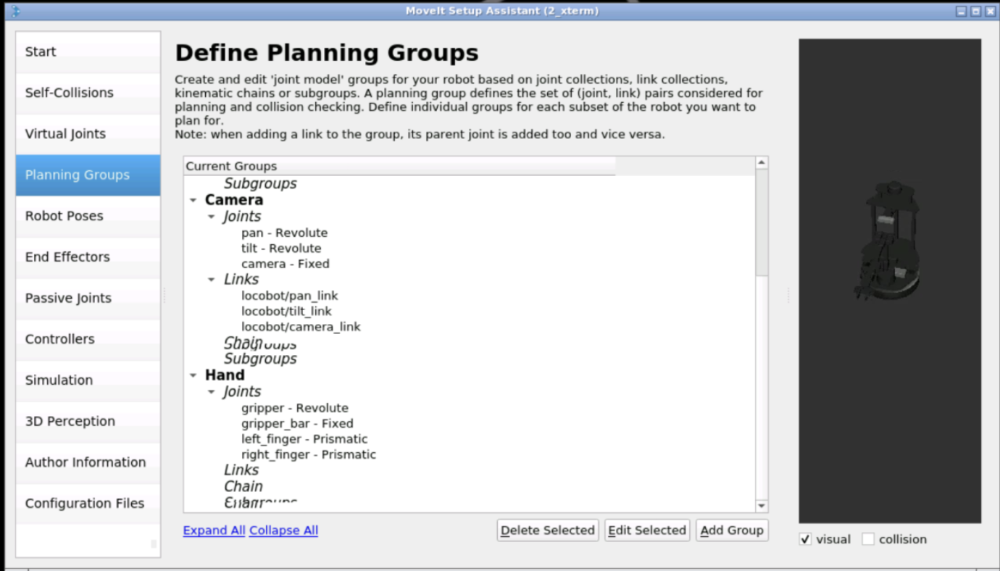
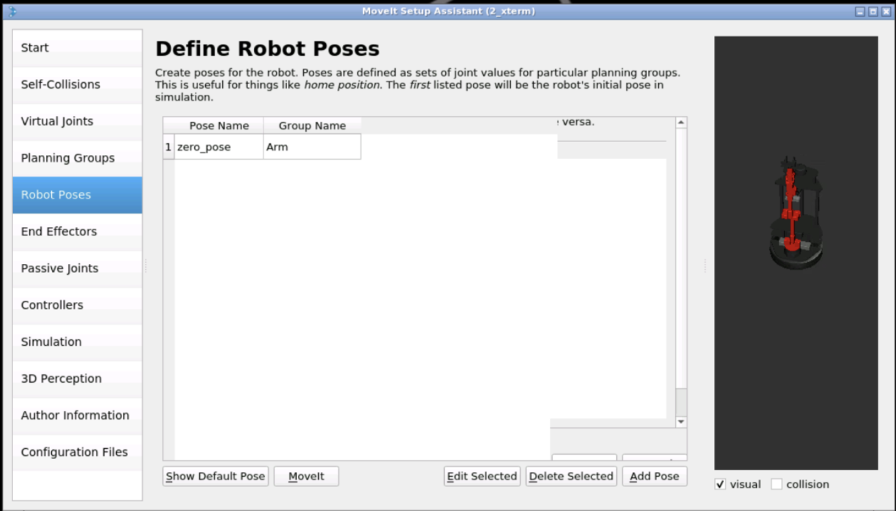
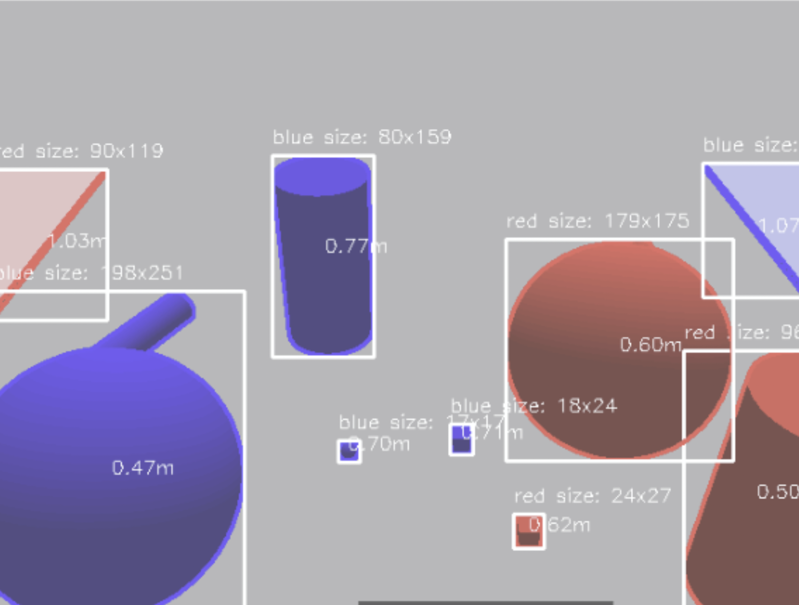
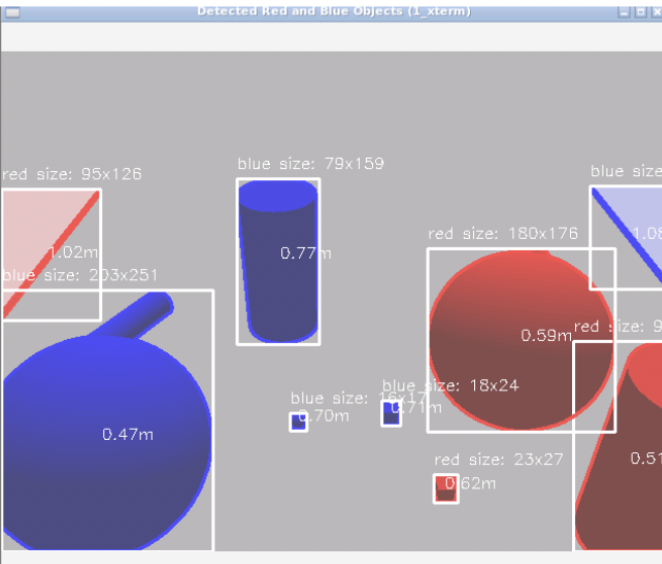

# Robot Arm Project

## Overview
This project involves the integration of a robotic arm with object detection capabilities, allowing the arm to interact with identified objects based on color. The system utilizes MoveIt for motion planning and control, while a custom script detects objects in the camera's view.

Videos:
[https://drive.google.com/drive/folders/14n3xa3PelWMIRGtozO4ou4DMAuhrlF_Q?usp=drive_link](https://drive.google.com/drive/folders/14n3xa3PelWMIRGtozO4ou4DMAuhrlF_Q)

## Setup and Configuration

### Step 1: MoveIt Setup
1. **Create Planning Groups**:
   - Configured planning groups for the robotic arm and gripper.
  
   

   
3. **Set End-Effector**:
   - Defined the gripper as the end-effector with the robotic arm as the parent group.
   
4. **Define Starting Pose**:
   - Established a basic starting pose for the arm and filled in the remaining MoveIt configurations for exporting.
  
   

### Step 2: Object Detection
1. **Camera Positioning**:
   - Initially moved the robot arm out of the camera's view to avoid obstructions during detection.

2. **Color Detection**:
   - Implemented a script that uses RGB value ranges to classify objects as red or blue.

3. **Distance Calculation**:
   - Calculated the distance of objects from the camera by determining the center of bounding boxes around detected objects.
   - Used the image center to guide the arm's movements, ensuring as many objects as possible are captured in the frame.

4. **Camera Control**:
   - Utilized the calculated distances to adjust the camera's pan and tilt, maximizing object visibility.
  
   

### Step 3: Pick up of simple objects (TRIED)
1. Choose the smallest and closest objects from the camera. (NEED TO GRAB IT BUT FAILED)
2. Perform trajectory to grab the object
3. Grab the object 
4. Drop the object in the dropzone
5. Repeat the process until it's done

### Individual contribution:

A lot of the tasks were split up into groups of 2 as we weren't able to use the construct program much individually during practical hours.

1. **MoveIT Setup**:
   - Niek: Created planning groups, set end-effector, define starting pose
   - Vincentas: Created planning groups, set end-effector, define starting pose
   - Li-Wei: Set virtual joints, set self collisions, configurate file
   - Joshua: Set virtual joints, set self collisions, configurate file
2. **Object Detection**:
   - Niek: Set rgb values for color detection, helped make base for camera positioning
   - Vincentas: Worked further on camera positioning base, Made color detection base, made distance calculation, gripper setup and camera control
   - Li-Wei: Worked on gripper, color + distance detection helped with camera positioning with Vincent
   - Joshua:
3. **Pick up of simple objects**:
   - Niek: Try to use teleoperation.py to control the arm movement, tried to use scripts to get the coordinates of the object
   - Vincentas: Made gripper close (but sadly not grip) gripper.py, tried to position the robot inside simulation to find the perfect position for an arm to grip things.
   - Li-Wei: Try to use teleoperation.py to control the arm movement, tried to use scripts to get the coordinates of the object
   - Joshua:
4. **Documentation**:
   - Niek: Made the presentation slides for step 1 and step 2 and github repo readme, video recording
   - Li-Wei: Made the presentation slide for step 3 and github repo readme, video recording

